# AWSコードシリーズの練習

CodePipelineのチュートリアルの実践してみました。

https://docs.aws.amazon.com/ja_jp/codepipeline/latest/userguide/tutorials-simple-codecommit.html

## CodeCommitリポジトリの作成

1. まずはコンソールからCodeCommitリポジトリを作成する。
   1. リポジトリ名をTestCodePipelineとする
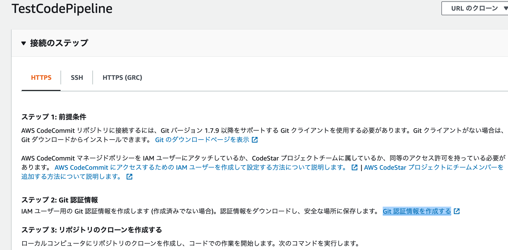
2. IAMユーザーの認証情報を設定
   1. 上記画面にも記載されている通り、CodeCommtにアクセスするためのIAMユーザー設定を行う
   2. ユーザーにCodeCommitへのSSHアクセスのためのキーアップロード等が必要
      1. Macであれば `ssh-keygen` コマンドでキーペアを作成
      2.  `cat ~/.ssh/キー名 | pbocpy` でクリップボードに公開鍵情報をコピー
      3.  Iamユーザーの「認証情報」タブからSSHパブリックキーのアップロードを行っておく
          1.  このあたりの詳しいやり方は以下を参照
          2. 公式:https://docs.aws.amazon.com/ja_jp/codecommit/latest/userguide/setting-up-gc.html?icmpid=docs_acc_console_connect_np
          3. 毎度おなじみdevelopers.io:https://dev.classmethod.jp/articles/codecommit-try/
      4. ~/.ssh/configに記載する `User`はIAMユーザー名ではないので注意
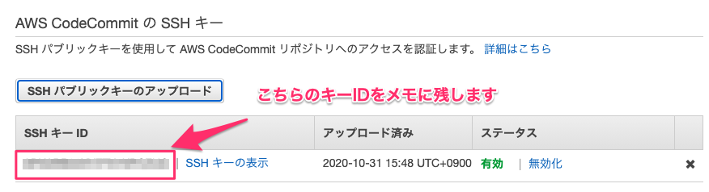
   3. 以下のようにメッセージが出たらcloneできている
```
Cloning into 'TestCodePipeline'...
warning: You appear to have cloned an empty repository.
```
   4. 公式から取得したCodeDeployサンプル用のファイル一式をプロジェクトルートに設置
      1. https://docs.aws.amazon.com/ja_jp/codepipeline/latest/userguide/samples/SampleApp_Linux.zip
   5. `git remote add origin ssh://作成したリポジトリ` を実行してoriginにcodecommitのリポジトリを登録する
   6. `git push origin master` でリポジトリにプッシュする。以下のようにコンソールに出力されればOK。CodeCommitの管理画面も確認する
```
Writing objects: 100% (13/13), 327.91 KiB | 19.29 MiB/s, done.
Total 13 (delta 0), reused 0 (delta 0)
To ssh://hoge
 * [new branch]      master -> master
```
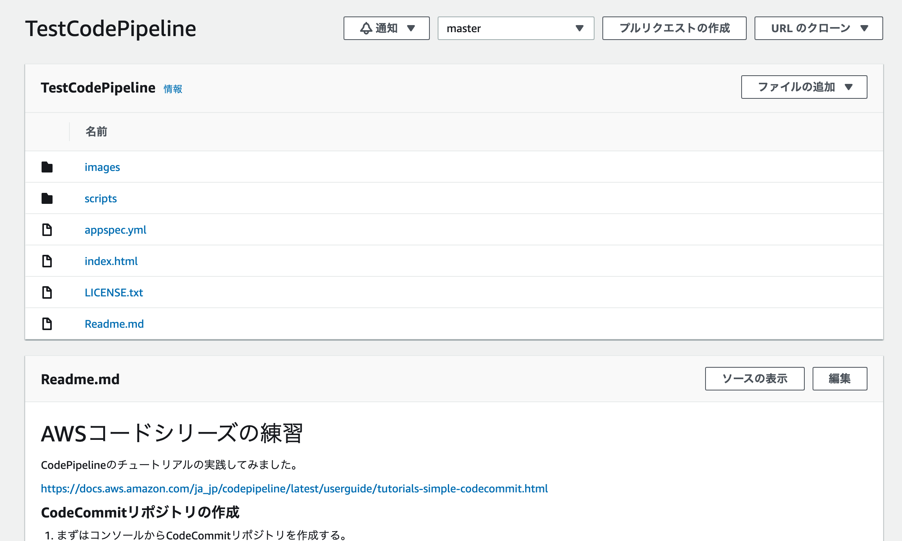


## EC2の作成

1. チュートリアルのステップ３にしたがってEC2を作成する
2. まずEC2にアタッチするためのIAMロールを作成しておく
   1. `AmazonEC2RoleforAWSCodeDeploy` のロールを作成
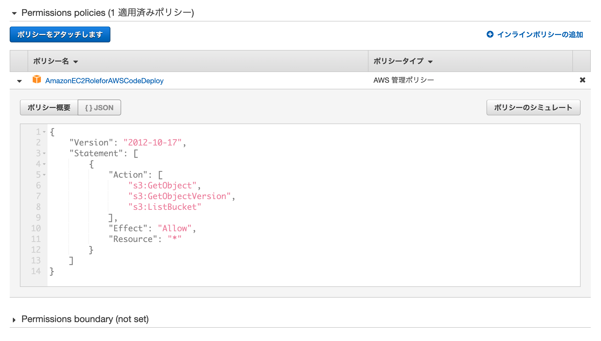
3. VPC/サブネットの設定
   1. チュートリアルでは触れられていないが、インスタンスをパブリックサブネットに配置しないと動作しない
      1. 適切なVPCがない場合は、VPCを作成
      2. サブネットを作成
      3. インターネットゲートウェイを作成し、VPCに配置する
      4. 作成したサブネットのルートテーブルを編集
         1. 送信先: 0.0.0.0/0
         2. ターゲット: 先ほど作成したインターネットゲートウェイ
4. セキュリティグループもチュートリアル通りに設定
   1. sshとhttpについて、MyIPを許可
5. インスタンスタイプ t2.microを選択
6. 先ほど作ったIAMロール(AmazonEC3RoleForAWSCodeDeploy)を関連づけておく
7. ユーザースクリプトについて、チュートリアルのものをそのままコピペすると失敗する。(sudoをつけて管理者権限で実行するようにしておく)

```bash
#!/bin/bash
sudo yum -y update
sudo yum install -y ruby
sudo yum install -y aws-cli
sudo cd /home/ec2-user
sudo wget https://aws-codedeploy-us-east-2.s3.us-east-2.amazonaws.com/latest/install
sudo chmod +x ./install
sudo ./install auto
```

## CodeDeployでアプリケーションを作成

1. こちらもチュートリアルにそってiamロールを作成する
   1. CodeDeployのAWS管理ロールを利用 `AWSCodeDeployRole` 
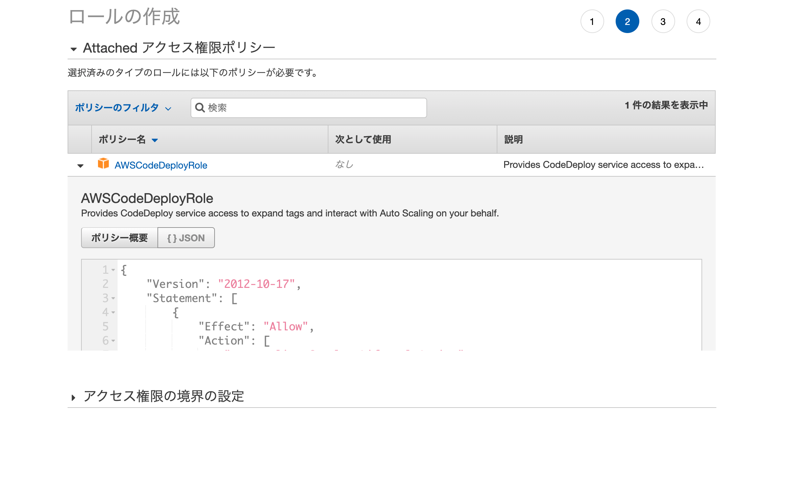
2. 新しいアプリケーションを作成
   1. 名前: TestCodeDeploy
   2. コンピューティングプラットフォーム: EC2/オンプレミス
      1. ここで `Name`タグに `TestCodeDeploy` が設定されているインスタンスが対象となるため設定に留意（異なる名前だと一致するEC2インスタンスがみつからない)
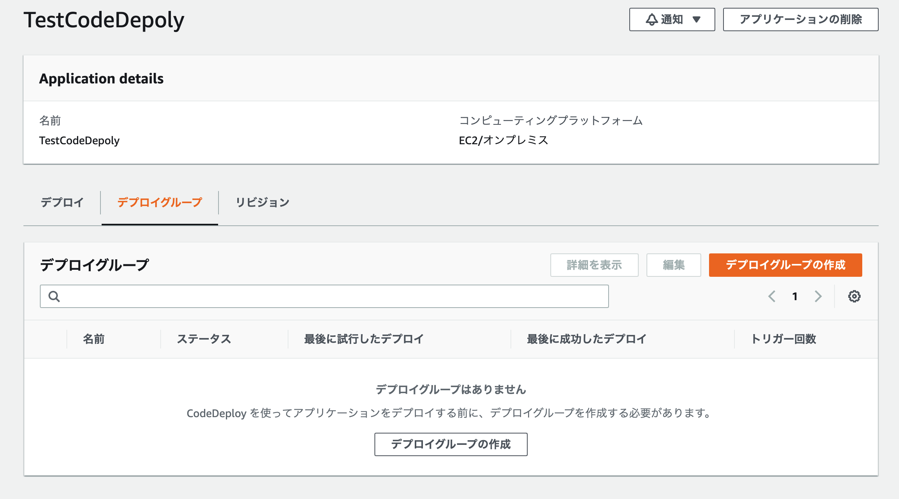
3. デプロイメントグループを作成
   1. デプロイタイプはインプレース
      1. BlueGreenも指定できる
   2. 環境設定: Amazon EC2インスタンス
      1. Name: TestCodeDeployのタグを設定
   3. デプロイ設定
      1. `CodeDeployDefault.OneAtTime`
   4. ロードバランシングの有効化からチェックを外す
      1. 今回はロードバランサーの設定はしない
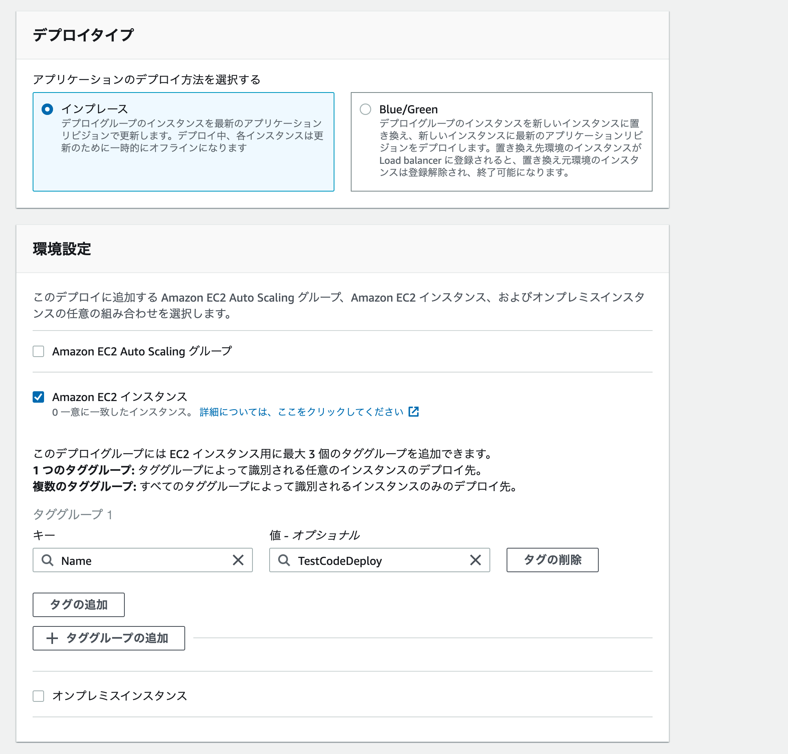

## CodepipeLineの設定

1. 新しいパイプラインを作成
2. 以下のように設定
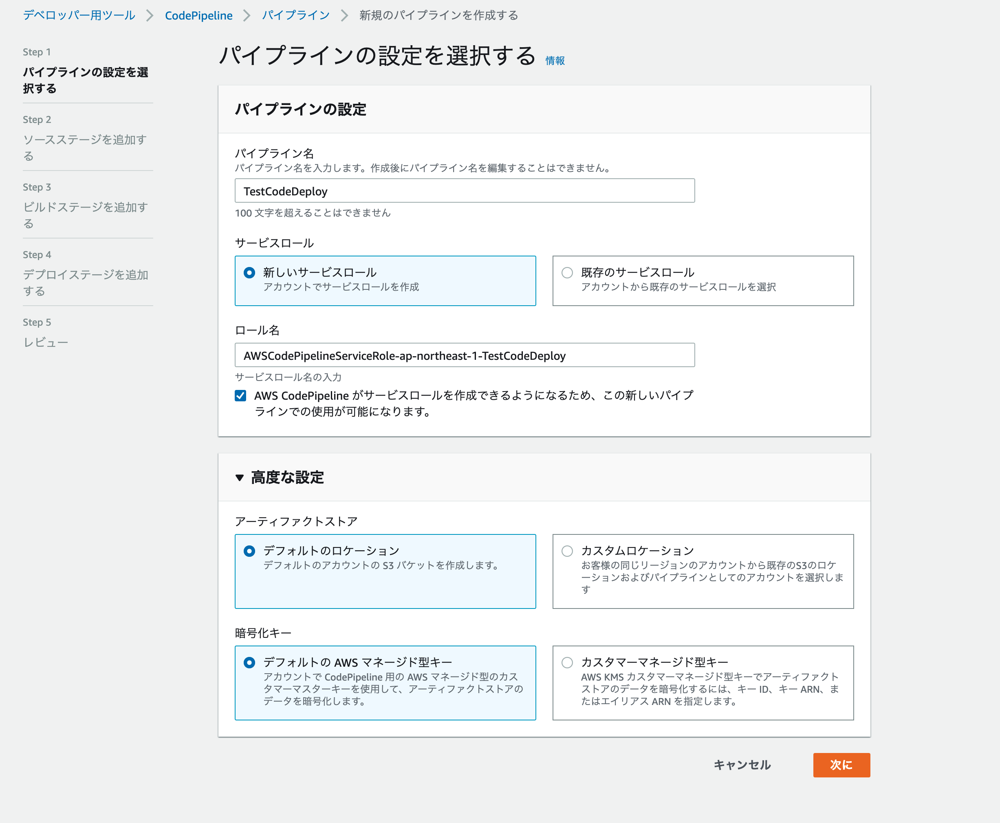
3. 先ほどCodeCommitで作成したリポジトリのmasterブランチが変更された際にイベントが発火するように設定
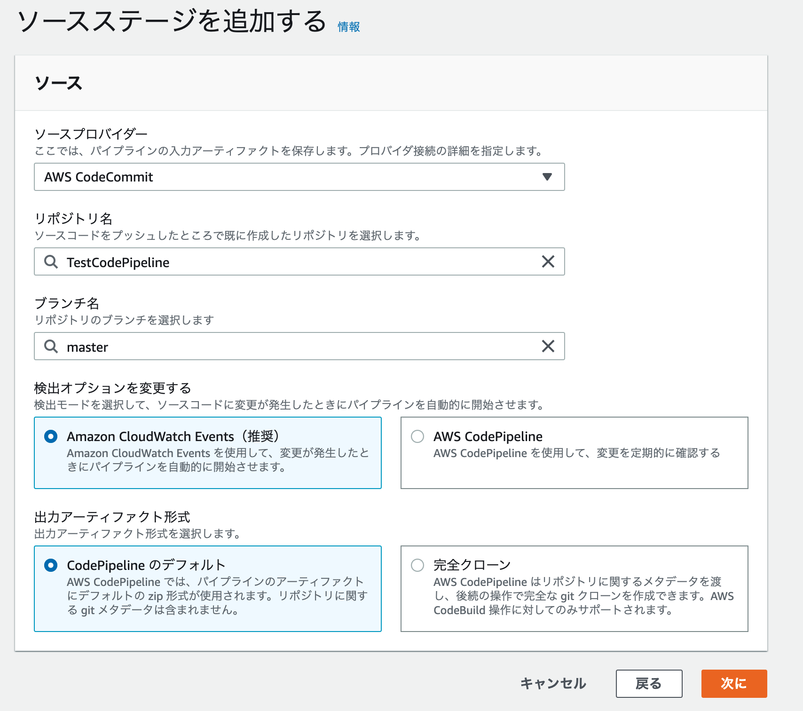
4. 今回は既存のEC2にデプロイを設定するので、ビルドステージはスキップする
   1. ビルドが必要な場合 CodeBuild等を作成しておきここで設定する
5. デプロイステージの設定
   1. 先ほど設定したCodeDeployと、デプロイグループを選択
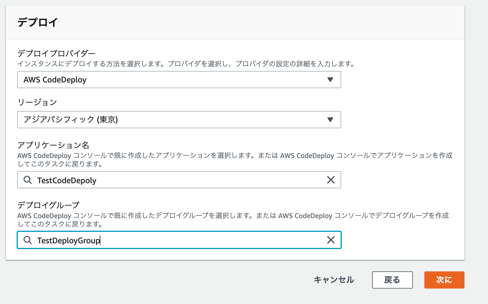
6. 確認して、パイプラインの作成
7. 以下のようにパイプラインの一連のステージが成功していることを確認する
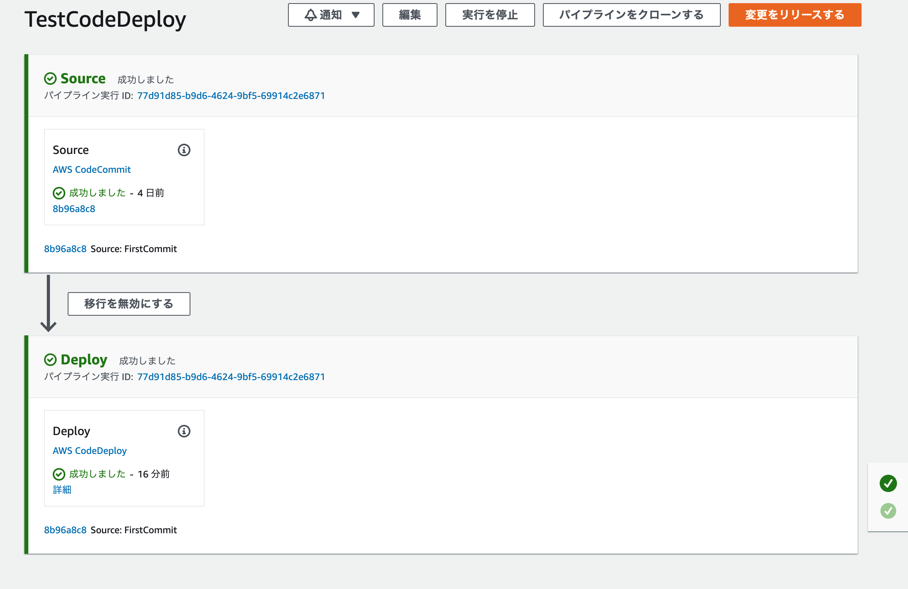

## アプリケーションの確認
1. 実行中のインスタンスのパブリックIPv4アドレスをコピーしておく
2. `http://コピーしたアドレス` にブラウザでアクセスする。以下のようにアプリケーションがデプロイされていることを確認する
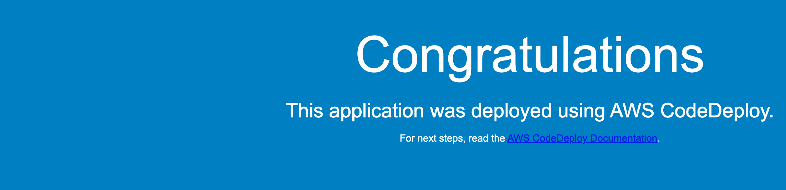

## ソース変更の検知を確認
1. ローカル環境でソースを変更する
2. 

